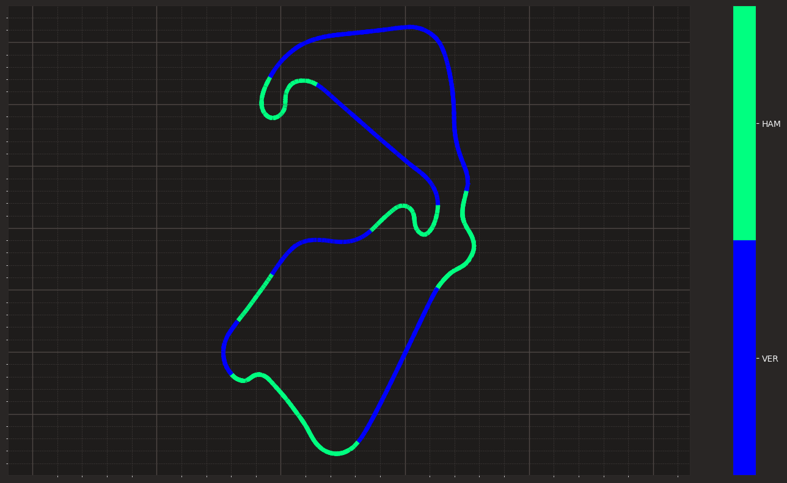
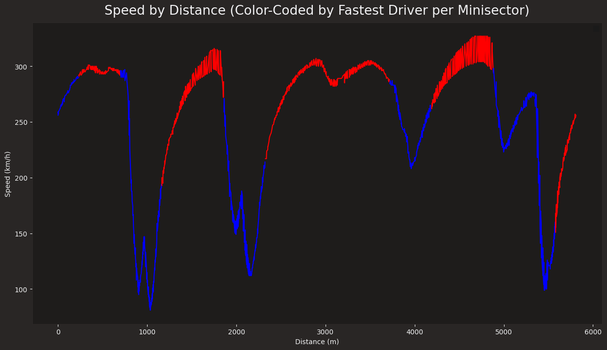

# F1 Minisector Analysis with Fast-F1 and Matplotlib


## Before you start...

<span style="color: red;">
This project was conducted in November 2024 and is based on the latest features and commands in the Fast-F1 library. Older projects available online may follow outdated commands and might not work as expected. Before using such projects, review the Fast-F1 documentation to make any necessary adjustments.
</span>

## Overview
This project is designed to analyze telemetry data from a Formula 1 race session and visualize the performance of two drivers across the track. We compare the speed of Max Verstappen ("VER") and Lewis Hamilton ("HAM") in different sections of the track (minisectors) to determine who is faster in each part. This analysis uses the Fast-F1 library, along with `matplotlib` for visualization.


<div style="display: flex; justify-content: space-between;">
  
  
</div>


The script processes telemetry data and divides the track into equally sized segments called "minisectors." We then determine which driver was fastest in each minisector, creating a color-coded visualization to show the fastest driver for each segment.

## Prerequisites
To run this code, you need to install the following Python packages:

- [Fast-F1](https://pypi.org/project/fastf1/): A Python library to access Formula 1 data.
- [Matplotlib](https://matplotlib.org/): A plotting library for creating visualizations.
- [NumPy](https://numpy.org/): A library for numerical operations.
- [Pandas](https://pandas.pydata.org/): A library for data manipulation.

To install these dependencies, you can use the following command:
```sh
pip install -r requirements.txt
```

Ensure that you have a `requirements.txt` file with the following content:
```txt
fastf1
matplotlib
numpy
pandas
```

## Step-by-Step Explanation

### 1. Import Libraries and Enable Caching
```python
import fastf1 as ff1
from fastf1 import plotting
from matplotlib import pyplot as plt
from matplotlib.collections import LineCollection
from matplotlib import cm
import numpy as np
import pandas as pd

ff1.Cache.enable_cache('./cache')
plotting.setup_mpl()
```
We start by importing all necessary libraries and enabling caching for Fast-F1 to speed up data retrieval in future runs.

### 2. Load Session Data
```python
session = ff1.get_session(2024, 'Silverstone', 'R')
load = session.load(telemetry=True)
```
We load telemetry data for the 2024 Silverstone race session (`'R'` for race). The `load(telemetry=True)` command retrieves all telemetry data, which includes the speed, distance, and coordinates of the car throughout the race.

### 3. Get Lap Data for Selected Drivers
```python
laps_ver = session.laps.pick_driver("VER")
laps_ham = session.laps.pick_driver("HAM")
```
We extract lap data for Max Verstappen (`"VER"`) and Lewis Hamilton (`"HAM"`). This allows us to analyze both drivers' performance throughout their laps.

### 4. Extract and Concatenate Telemetry Data
```python
fastest_ver = laps_ver.pick_fastest().get_telemetry().assign(Driver='VER').add_distance()
fastest_ham = laps_ham.pick_fastest().get_telemetry().assign(Driver='HAM').add_distance()
telemetry = pd.concat([fastest_ver, fastest_ham], ignore_index=True)
```
We extract telemetry data for each driver's fastest lap, concatenate it into a single DataFrame, and add a column to identify the driver (`'Driver'`). The telemetry data includes information such as speed, distance, and track coordinates.

### 5. Define Minisectors and Assign Them to Telemetry Data
```python
num_minisectors = 25
track_length = telemetry['Distance'].max()
minisector_length = track_length / num_minisectors
telemetry['Minisector'] = (telemetry['Distance'] // minisector_length).astype(int)
```
We divide the track into 25 minisectors of equal length and assign each telemetry point to a minisector. This helps us compare driver speeds in different parts of the track.

### 6. Calculate Fastest Driver per Minisector
```python
avg_speed_per_minisector = telemetry.groupby(['Minisector', 'Driver'])['Speed'].mean().unstack()
fastest_driver_per_minisector = avg_speed_per_minisector.idxmax(axis=1)
telemetry = telemetry.merge(fastest_driver_per_minisector.rename('Fastest_Driver'), how='left', on='Minisector')
```
We calculate the average speed for each driver in each minisector. The `idxmax()` function helps identify the driver with the highest average speed in each minisector, and we add this information back to the telemetry data.

### 7. Visualize Speed by Distance
```python
plt.figure(figsize=(15, 8))
for minisector in telemetry['Minisector'].unique():
    sector_data = telemetry[telemetry['Minisector'] == minisector]
    color = 'red' if sector_data['Fastest_Driver'].iloc[0] == 'VER' else 'blue'
    plt.plot(sector_data['Distance'], sector_data['Speed'], color=color)
```
We plot the speed against the distance for each minisector, using red to represent Verstappen and blue to represent Hamilton. This visualization shows which driver was faster at each point of the track, allowing us to compare performance.

### 8. Visualize the Track with Color-Coded Fastest Driver
```python
x = np.array(telemetry['X'].values)
y = np.array(telemetry['Y'].values)
points = np.array([x, y]).T.reshape(-1, 1, 2)
segments = np.concatenate([points[:-1], points[1:]], axis=1)
fastest_driver_array = telemetry['Fastest_Driver_Int'].to_numpy().astype(float)
cmap = cm.get_cmap('winter', 2)
lc_comp = LineCollection(segments, norm=plt.Normalize(1, cmap.N + 1), cmap=cmap)
lc_comp.set_array(fastest_driver_array)
lc_comp.set_linewidth(5)
fig, ax = plt.subplots()
ax.add_collection(lc_comp)
plt.colorbar(mappable=lc_comp, boundaries=np.arange(1, 4), ticks=[1.5, 2.5], ticklabels=['VER', 'HAM'])
plt.savefig("2023_ver_ham_q.png", dpi=300)
plt.show()
```
In this part, we visualize the track itself, color-coded based on the fastest driver in each minisector. We use `LineCollection` to represent segments of the track, and we add a color bar to show which color corresponds to each driver.

## Results and What They Mean
1. **Minisector Start Distances**: The output of the list of minisector start distances helps us visualize how the track is divided into smaller segments for analysis. Each minisector starts at a specific distance from the starting line, which we use to calculate speeds and determine which driver was fastest.

2. **Fastest Driver per Minisector**: The output showing the fastest driver for each minisector indicates which driver was faster in that section of the track. It helps identify the performance of each driver in specific areas, such as corners, straights, or other critical track segments.

3. **Speed Plot by Distance**: The first plot (`Speed by Distance`) gives a clear view of where each driver was faster. For example, a straight colored in red means that Verstappen had a higher speed in that straight compared to Hamilton. Consistent blue or red areas may show where one driver had a better car setup or was more efficient.

4. **Track Visualization**: The final track visualization uses color-coding to indicate the fastest driver for each minisector. It helps provide an intuitive understanding of which driver performed better in specific sections, making it easy to see who was dominant throughout the track.

## Summary
- This project helps to compare driver performance across different segments of a race track by using telemetry data and dividing the track into minisectors.
- The visualizations provide insight into which driver had a better setup or driving style for each section of the track.
- The analysis makes use of Fast-F1 to retrieve the data, and `matplotlib` to visualize the data.

This script allows Formula 1 fans, analysts, or engineers to better understand driver performance in detail, and identify strengths or weaknesses in different track sections.

